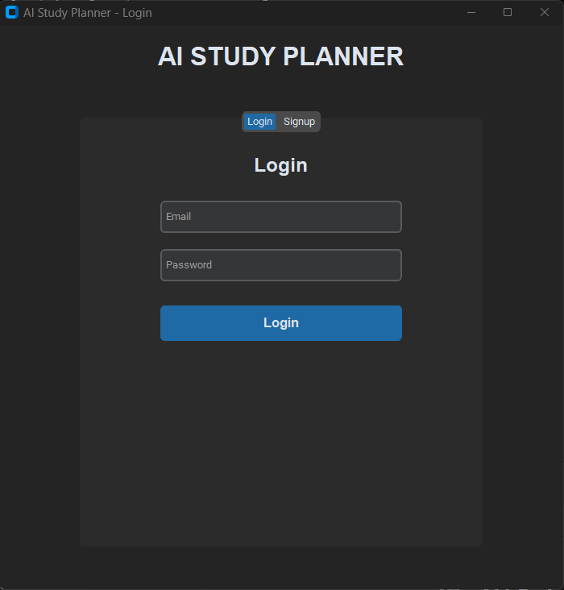
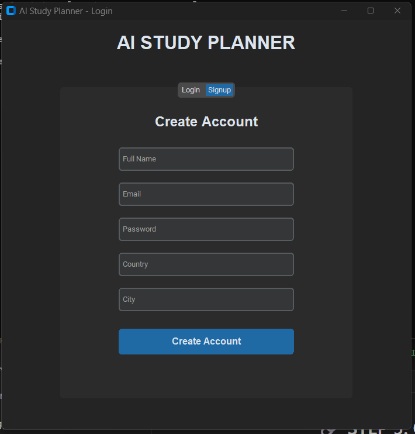
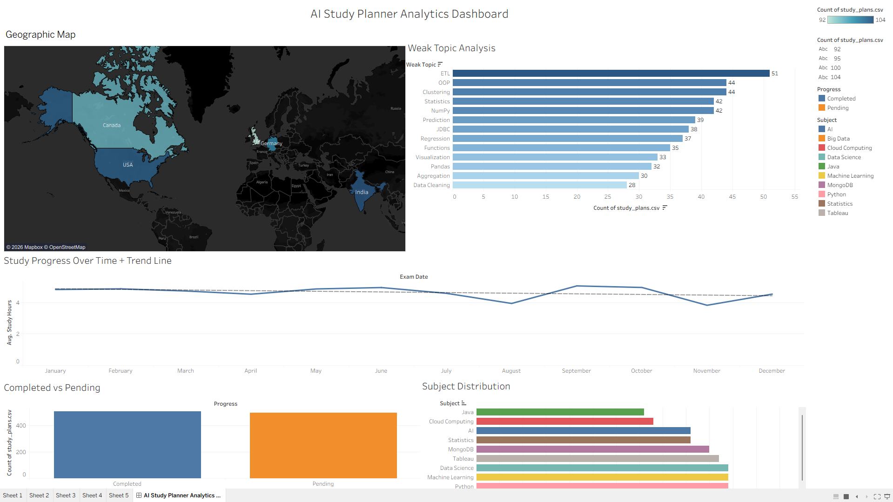
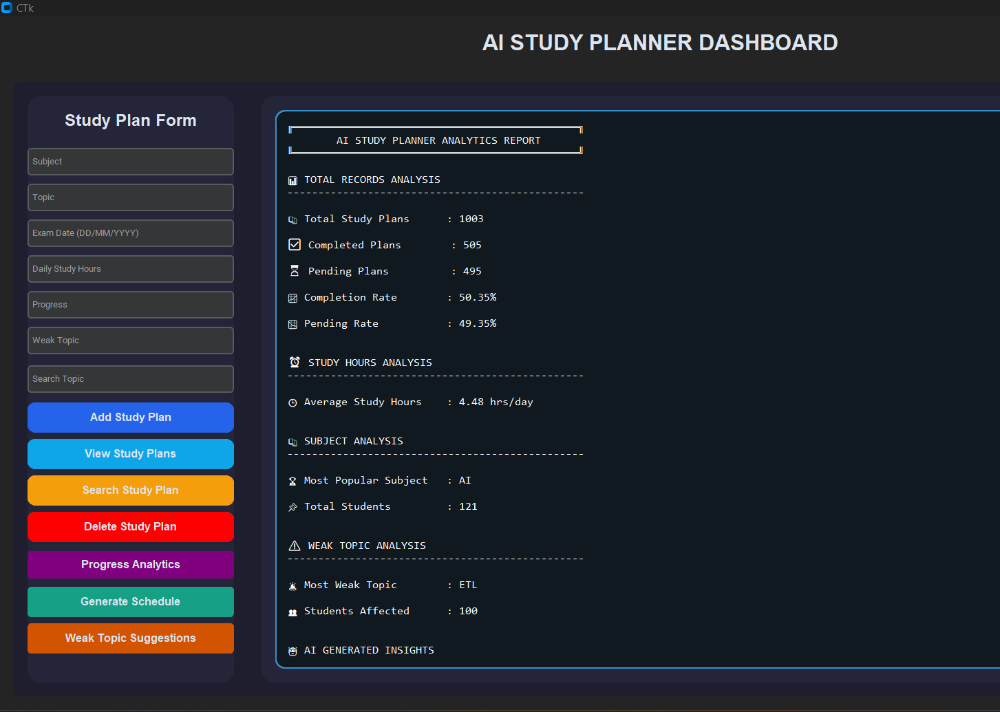
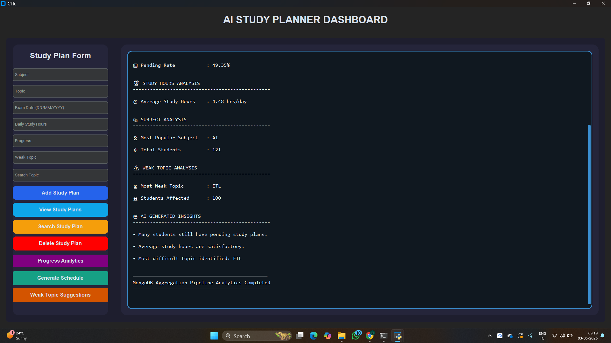

# 📚 AI Study Planner

An AI-powered study planner that helps students create personalized schedules, track progress, and focus on weak subjects. The system also analyzes user data to generate insights using MongoDB and Tableau.

---

## 🚀 Features

- 🔐 User Authentication (Login/Signup)
- 📅 Smart Study Schedule Generator
- 📊 Progress Tracking System
- 🧠 Weak Topic Identification
- 🌍 User Data Analysis (City & Country)
- 📈 MongoDB Aggregation Analytics
- 📊 Tableau Dashboard Integration

---

## 🛠️ Tech Stack

- Python
- MongoDB
- Tkinter / CustomTkinter
- Pandas
- Faker
- Tableau

---

## 📊 Analytics Work

- Identified user distribution by country and city
- Detected weak topics using aggregation pipeline
- Calculated completion rate and study hours
- Exported data for visualization in Tableau dashboard

---

## ▶️ How to Run

1. Start MongoDB
2. Run:  python app/auth_gui.py

---

## 📸 Screenshots

### 🔐 Login Page

### 📝 Signup Page

### 📊 Dashboard

### 📈 Analytics Report 1

### 📈 Analytics Report 2

---

## 📌 Future Scope

- Convert into web application (Flask/Django)
- Add AI recommendation engine
- Deploy on cloud (AWS/Render)

---

## 👨‍💻 Author

Harsh Uttamani